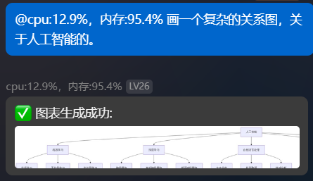
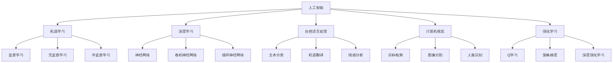

# AstrBot 图表生成插件

这是一个用于AstrBot的图表生成插件，它使用mermaid-py库将文本描述转换为精美的图表。

## 功能

- 通过大语言模型将文本描述转换为Mermaid语法
- 使用mermaid-py库将Mermaid语法渲染为图像
- 自动处理和清理临时文件

## 使用方法

1. 使用以下命令生成图表：

```
/mermaid [主题]
```

例如：
- `/mermaid 编程语言`
- `/mermaid 人工智能发展历程`
- `/mermaid 学习计划`

2. 命令llm生成图表，llm会自动调用工具生成。

插件会自动使用大语言模型生成符合主题的图表，并以图片形式发送。

示例：



## TODO
- 更灵活的生成不同图表

## 依赖

- mermaid-py>=0.7.1
  
## 更新日志
- v1.0.0 初次发布
- v1.1.0 完善了对llm生成文本的识别
- v1.2.0 增加重试连接、清除临时文件机制
- v1.2.1 更新prompt，可以画出更完善的图表

## 注意事项

- 生成的图片会存储在临时目录中，插件卸载时会自动清理
- 图表的复杂度取决于大语言模型的能力和理解
- 复杂的图表可能需要更多时间生成

## 许可证

MIT
